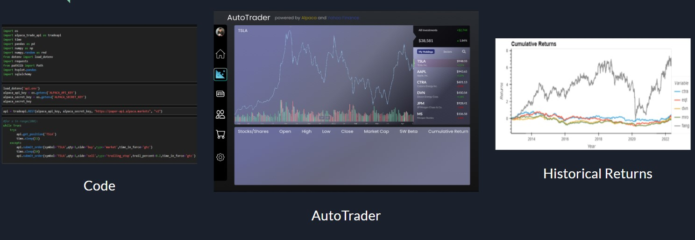
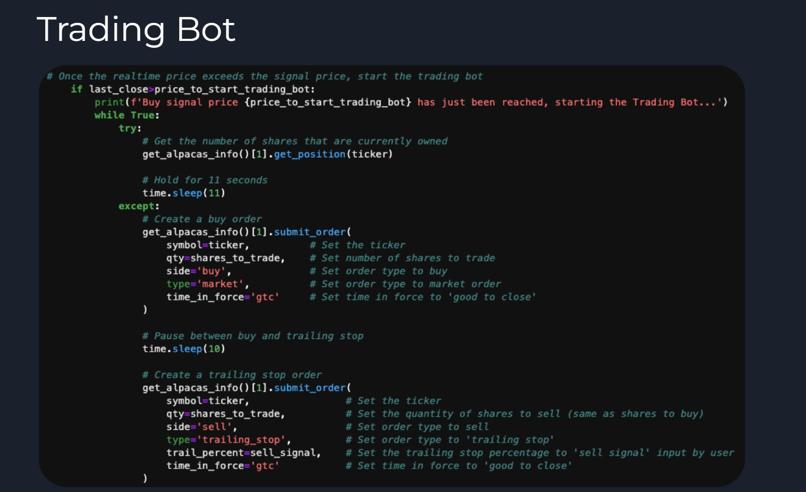
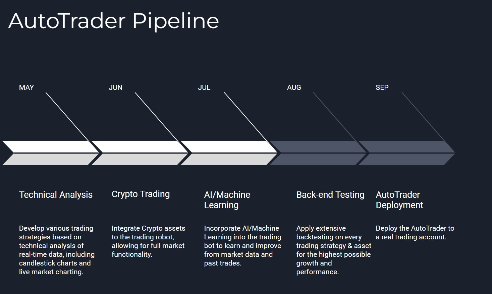

# AutoTrader Application

## Overview & Features
We are proud to showcase the development of an AutoTrader application that provides users who don't have the time and resource the research, analysis and trading capability through our fully-integrated Stock-Trading application.

This Application includes the following features:
1. Analysis and recommendation of the top performing stocks within the Technology, Energy, Health,       Utility, and Finance Sectors.
2. User friendly and interactive program that allows users to select and create the parameters from which the trading bot will operate.
3. A fully automated trading program that will take the variables from the user inputs in the previous step and actively execute real trades in the marketplace.

* A subscription to ALPACA API of $7/month is needed to run the AutoTrader.
* For the AutoTrader can only place trades during market hours (9:30am -4pm).

   

---

## Technologies

Our AutoTrader Applicatoin utilizes  **Python (v 3.9.7)** and the following libraries:

`1. fire 2. questionary 3. time 4. Path from pathlib 5. pandas 6. numpy 7. numpy.random 8.alpaca_trade_api 9. load_dotenv 10. requests 11. hvplot.pandas 12. sqlalchemy 13. os 14. ast 15. json 16. requests_html 17. ftplib 18. yahoo_fin 19. IPython.display 20. io 21. atploblib.pyplot 22. mplot3d from mpl_toolkits 23. talib 24. websocket 25. plotly 26. panel`

---

## Installation Guide
Majority of the above libraries should be part of the base applications that were installed with the Python version above; if not, you will have to install them through the pip package manager of Python.

[PIP Install Support Web Site](https://packaging.python.org/en/latest/tutorials/installing-packages/#ensure-you-can-run-python-from-the-command-line)

---
## Application Sections

1. **Industry Sector ticker Analysis**:   The first step in the application was the research, analysis, and recommendation of prospective stock opportunities. The criteria for the initial sample of stocks were the top performing tickers in the Industry Sectors below that had returns that were greater or equal to 2% for the last 12 trading months. We utilized the Yahoo Finance API to draw historical data for our ticker selections based on the above criteria. We cleaned and fed this information into a dataframe focusing on the daily closing prices of each stock, and then applied various filters such as the entire history of each company’s returns compared with only the period of time in which all stocks existed and traded simultaneously on the market. One of the best features of this prototype is the ease with which we can interchange the stock tickers in question for analysis. Further refinement is of course planned, but even in our current iteration we can analyze any cross-section of companies a customer wishes to look at with extreme ease. Also generated are key fundamental and technical stats/reports for the 2 recommended tickers within each Sector that the user can review.
 
 Below are the links to each Industry Sector stock analysis for your reference:
   >[Technology](./Industry_sector_tickers_analysis/tech_stocks_analysis_selection.ipynb)
  
   >[Energy](./Industry_sector_tickers_analysis/energy_stocks_analysis_selection.ipynb)

   >[Health](./Industry_sector_tickers_analysis/health_stocks_analysis_selection.ipynb)

   >[Utility](./Industry_sector_tickers_analysis/utilities_stocks_analysis_selection.ipynb)

   >[Finance](./Industry_sector_tickers_analysis/finance_stocks_analysis_selection.ipynb)

   
 

2. **Command line Interface Section**: During the development of the AutoTrader, we recognized that buy and sell signals would significantly improve the overall effectiveness of the AutoTrader. So we allowed the user to have the functionality to input their signals directly to the AutoTrader utilizing python's Fire and Questionary Libraries. 

*Steps on how the User interacts with the AutoTrader:*

 >a) The Python file, "input_Real__Time_Buy_Signal.py" imports the "sectors_and_tickers.csv" from the Resources folder. 
The sectors are reviewed and set as the choices to refine which stocks are available to trade.

 >b) Once the sector is selected, a second selection lists the 2 tickers within the selected sector the user can pick to trade.

 >c)Upon selecting the ticker, the user will set the total amount they would like to trade for that stock as a percentage of their total liquid capital. The program will then input the buy and sell signals as percentages, launch the bot, and begin trading.

3. **AutoTrader Trading Algorithm**: For the development of this trading algorithm we wanted the user to have the ultimate control over the signal inputs that would initiate any trades. Please note, the Alpaca API was utilzied for the data collection used for the algorithm analysis and placing trades in our paper account.

*Steps on how the users inputs are used to place trades*:

>a) From the inputs from section 2 above; The Users ticker selection, trading parameters and signals will be sent to the AutoTrader Trading Algorithm to iterate through all the incoming trading data.

>b) The bot will send the User messages and alerts once a signal condition has been met.

>c) Once the message has been sent the bot will place a trade based on the signal using a trailing stop order. 

[AutoTrader_Application](input_Real_Time_Buy_Signal.py)

>

---

## Development Pipeline

*Technical_Analysis_Future_PiPline.ipynb* - This file is a prototype of a future upgrade to the AutoTrader that will be utilzing Technical Analysis.
[Technical_Analysis_Upgrade](./Technical_Analysis_Future_Pipline.ipynb)

>

---

## Contributors
Contributors for the creation and deployment of the Autotrader Application and duties:

1. Ryan Anderson: a) Repo Owner b) Python Fire Function (Terminal functionality)
2. Tao Chen: a) Simple trading bot b) Real time data stream & stock technical analysis programming
3. James Handral: a)Industry sector tickers Data Collection, Clean up & Analysis  b) README file
4. Colton Mayes: a) Final Presentation b) Visualization for Presentation
5. Anton Maliksi: a) README file b) Final Presentation

---

## Licenses
No licenses were used for this project.